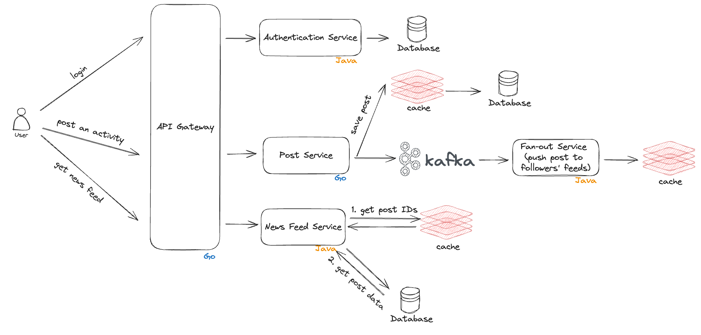

# Stravo

Best way to learn is to actually build things. This is an Strava-like app where user can post their activities and view those of others as well. It is for educational purpose only.

## Overview

### Architecture Overview

### Stack
- Language: Go, Java
- Web framework/routers: chi (Go), Spring (Java)
- Database: PostgreSQL
- Caching: Redis
- Message queue: Kafka
- Monitoring: Grafana, Prometheus
- Deployment: Docker Container, Linux server

## Development Logs

**2024 Jun 5**

- Added architecture overview.

## Acknowledgements